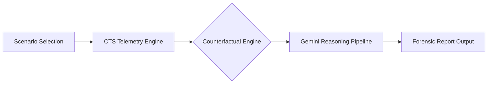

# 🧠 Cognitive Threat Modeling Assistant (CTMA)
> **Human Factors Forensics for the Modern Cyber Attack Surface**

---

## 🌐 Overview
The **Cognitive Threat Modeling Assistant (CTMA)** is a world-class forensic application that shifts the cybersecurity paradigm from "System-Centric" to "Human-Centric." It operates on the principle that the most critical vulnerability in any network is not a missing patch, but the **human cognitive architecture.**

By leveraging the **Gemini 3 Pro** engine, CTMA ingests high-resolution telemetry from the **Cognitive Telemetry Sandbox (CTS)** to reconstruct, analyze, and mitigate security failures caused by cognitive pressure, bias, and heuristics.

---

## 🛠️ System Architecture

### 1. Cognitive Telemetry Sandbox (CTS)
The **CTS** is the pulse of the application. It generates synchronized streams of data that model:
*   **[C] Cognitive State:** Real-time snapshots of workload level, time pressure, and attentional capacity.
*   **[E] Environmental Events:** System signals, alert arrival times, and visual similarity of stimuli.
*   **[I] Interaction Logs:** Micro-level user behavior, including decision latency (measured in milliseconds), warning dismissals, and click paths.

### 2. Counterfactual Reasoning Engine
A unique feature of CTMA that allows analysts to "rewind and modify" assumptions. By toggling variables like **Alert Density** or **Urgency Cues**, the AI calculates the probability of a different outcome, providing deep insights into which specific stressors were the "root cause" of a breach.

---

## 🔬 Scientific Foundations & Academic Citations

CTMA transforms abstract psychological concepts into actionable security intelligence:

### 📖 Dual Process Theory
*   **Citation:** Kahneman, D. (2011). *Thinking, Fast and Slow*.
*   **Application:** Analyzes the transition from analytical **System 2** thinking to reactive, heuristic-based **System 1** thinking under high-pressure scenarios like the *Multitasking Interruption Storm*.

### 📖 Cognitive Load Theory (CLT)
*   **Citation:** Sweller, J. (1988). *Cognitive Load During Problem Solving*.
*   **Application:** Quantifies the "Intrinsic Load" of security tasks. CTMA identifies the point of **Cognitive Overload** where working memory fails and security protocols are bypassed.

### 📖 Vigilance Decrement (The Mackworth Clock)
*   **Citation:** Mackworth, N. H. (1948). *The Breakdown of Vigilance During Prolonged Visual Search*.
*   **Application:** Modeled in the *Alert-Fatigued Analyst* scenario, tracking the decay of signal detection accuracy during long shifts.

### 📖 Automation Bias & Habituation
*   **Citation:** Parasuraman, R., & Manzey, D. H. (2010). *Complacency and Bias in Human Use of Automation*.
*   **Application:** Uses CTS data to detect **habituation loops** where users click "Dismiss" within <500ms due to visual similarity with previous benign alerts.

---

## 📑 The Forensic Pipeline (4 Stages)

When "Execute Forensic Analysis" is triggered, Gemini processes the CTS data through four rigorous stages:

1.  **STAGE 1: Cognitive Reconstruction**  
    A temporal narrative of the user's mental journey. It maps stimuli arrival to shifts in perceived workload without judging the outcome.
2.  **STAGE 2: Cognitive Vulnerability Inference**  
    The AI maps specific behavior (e.g., [I-2] latency of 0.4s) to active vulnerabilities like **Automation Bias** or **Time Pressure Heuristics**.
3.  **STAGE 3: Counterfactual Reasoning**  
    The engine reasons about the "What If." If counterfactuals are enabled, it explicitly calculates the delta in risk if environmental stressors were reduced.
4.  **STAGE 4: Human-Centered Mitigations**  
    Instead of proposing "better passwords," the system recommends **Design-Level** changes (e.g., variable alert delays to break habituation) and **Training-Level** interventions (e.g., metacognitive training).

---

## ⚖️ Ethical & Methodological Justification

### The Use of Sandbox (CTS) Telemetry
CTMA exclusively uses **Simulated Sandbox Telemetry** for three critical reasons:
1.  **Deterministic Replay:** Forensic reasoning requires a "Ground Truth" that can be consistently re-evaluated under different counterfactual assumptions.
2.  **Privacy-by-Design:** Analyzing cognitive states is highly invasive. Using synthetic models allows for the study of *patterns* of failure without exposing real employees to "thought monitoring."
3.  **Edge-Case Stress Testing:** Real-world logs rarely capture the moment of "extreme overload." The sandbox allows us to simulate high-stress conditions that are necessary for robust threat modeling.

---
**CTMA Core v2.1.4_STABLE** | *Engineered for the intersection of Mind and Machine.*